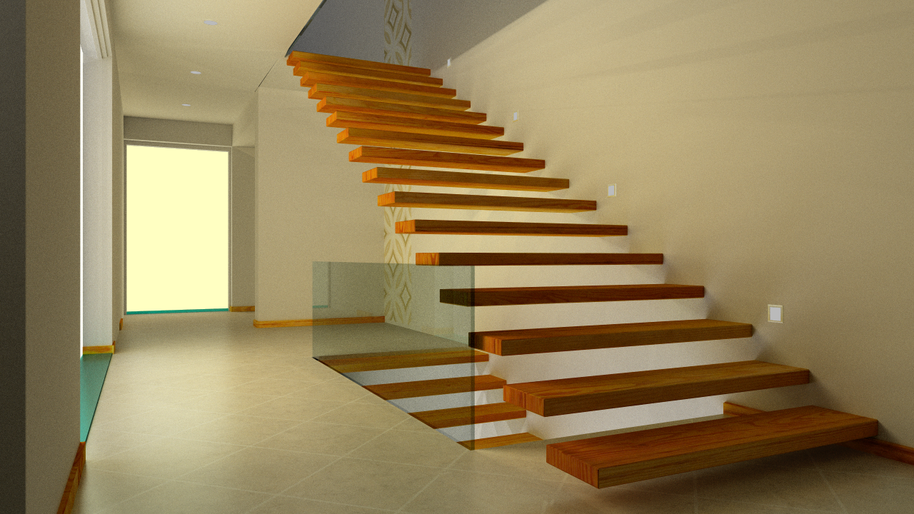

# 计算机图形学作业说明文档

  
贺云鹏 22121031

  

---

## 1 功能实现

本次作业实现了蒙特卡洛路径追踪算法，具体实现框架如下：

+ BVH加速结构

+ 蒙特卡洛路径追踪

+ MIS

  

## 2 编程环境

操作系统：Windows11家庭中文版

程序编译使用**Visual Studio 2022**

  
程序运行说明：

在src/main.cpp文件中，三个函数`DrawCornellBox(int draw_cnt)`、`DrawVeachMIS(int draw_cnt)`、`DrawStairscase(int draw_cnt)`分别用于绘制三个模型，draw_cnt代表绘制次数，每次spp为5。绘制结果保存在MCPathTracer/MCPathTracer。下图是绘制了100次后的结果（spp=500）

## 3 第三方库使用

+ Eigen C++线性代数函数库

+ `Window.h` 软光栅，实时显示绘制图像

+ `stb_image.h` ?图像解码库，用于读入图像

+ `stb_image_write.h` 用于保存结果图像

